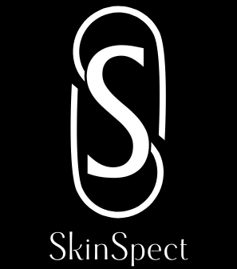

#  SkinSpect – AI-Powered Skincare Login Page

Welcome to **SkinSpect**, your personalised AI skincare companion!  
This repository currently contains the **Login Page UI**, the first step in accessing a magical AI-powered skincare world tailored for diverse skin types and tones.

---

## 🚀 Project Overview

- SkinSpect aims to become a futuristic AI-powered skincare platform designed especially for skin of colour. This repo features the **Login Interface**, designed using **HTML/CSS/JS**.
- The site is live at: 🔗 [https://neha-611.github.io/SkinSpect/](https://neha-611.github.io/SkinSpect/)

---

## ✨ Features (Login Page Only)
- 🧊 **Modern Glassmorphism UI**
- 🔐 **Username & Password Authentication Fields**
- 🌐 **Social Login Icons** (Facebook, Google, Microsoft, Apple – static only for now)

---

## 🧠 Future Plans

SkinSpect aims to become a futuristic AI-powered skincare platform designed especially for skin of colour. This repo features the **Login Interface**, designed using:- Add authentication backend (Firebase/Auth0)
- Build signup and forgot password flows
- Dashboard for skincare analysis
- Integration with an AI chatbot
- Skin scan upload & report generation

---

